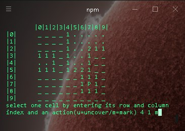

# MinesweeperNode
This is a console/terminal game based on minesweeper made for node.js

<br>

# Table of Contents
* [Installation](#Installation)
* [Testing](#Testing)
* [People](#People)

## Installation
Before installing, [download and install Node.js](https://nodejs.org/en/download/).
Node.js 0.10 or higher is required.

Installation is done using the
[`npm install` command](https://docs.npmjs.com/getting-started/installing-npm-packages-locally):

To run the game use `npm start` command

```bash
  $ npm install
  $ npm start
```

have fun! :wink:

## Testing
To test this program you need to [`checkout`](https://git-scm.com/docs/git-checkout) from master branch to develop branch
```bash
  $ git checkout develop
```
then you can use `npm test` command

```bash
  $ npm start
```

## People

author [Miguel Rodriguez](https://github.com/MiguelRodriguezR)
